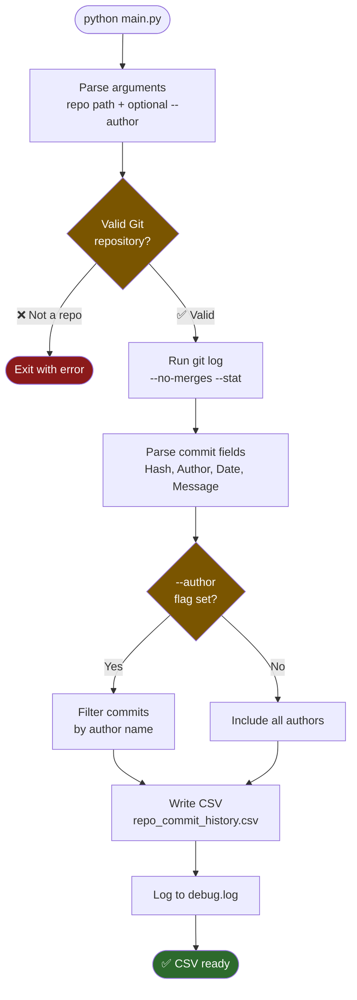

# GitCommitHistoryToCSV

<!-- BADGES:START -->
      
<!-- BADGES:END -->

## 📄 Description

GitCommitHistoryToCSV is a Python script that automates the extraction of Git commit logs into a CSV file. It's designed to parse the commit history of a given Git repository, with an option to filter by a specific author, and convert it into a structured CSV format for analysis and reporting.

## ✨ Features
- Extracts commit logs from any Git repository.
- Option to filter commits by a specific author or include all authors.
- Excludes merge commits for clearer data analysis.
- Generates a CSV file with detailed commit information.
- Automatically names files based on the repository name.
- Comprehensive logging of operations and errors for troubleshooting - see `debug.log` for detailed information.
- Command-line interface for easy script execution and automation.

## 📋 Prerequisites
- Python 3
- Pandas library

## 📥 Installation
1. Clone the repository: `git clone https://github.com/5a9awneh/GitCommitHistoryToCSV.git`
2. Navigate to the script directory: `cd GitCommitHistoryToCSV`
3. Install required packages: `pip install -r requirements.txt`

## 🚀 Usage
Run the script from the command line by providing the path to the Git repository:

`python main.py "/path/to/your Git repository" --author "author's GitHub username"`

Replace `"/path/to/your Git repository"` with the full path to your Git repository. If your path includes spaces, ensure it is enclosed in quotes.

The `--author` flag is optional and allows you to filter commits by a specific author. If omitted, commits from all authors will be included.

The script will generate a CSV file in the script's directory, named `<repository_name>_commit_history.csv`.

## 📊 Output Format
The generated CSV file contains the following columns:
- Repository URL
- Branch
- Commit ID
- Author
- Date
- Time
- Message
- Files Changed
- Insertions (+)
- Deletions (-)

## 🤝 Contributing
Contributions to this project are welcome. Feel free to fork the repository and submit pull requests.

## 📄 License
This project is licensed under the [MIT License](https://choosealicense.com/licenses/mit/).
